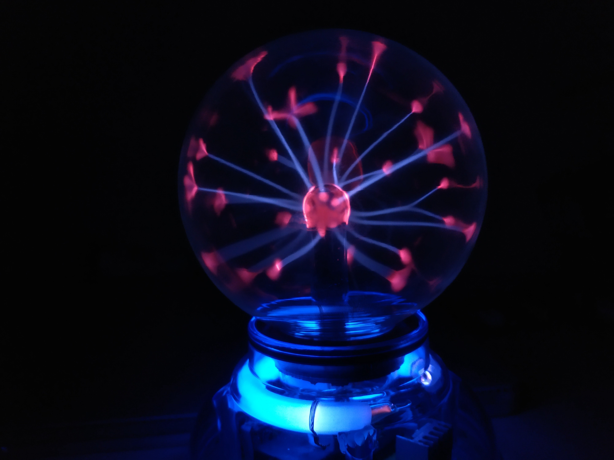
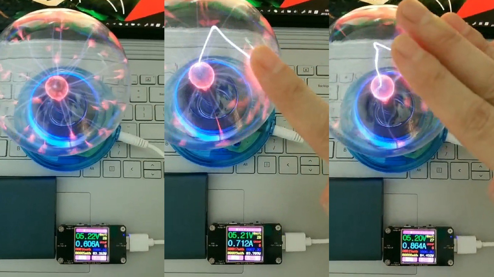
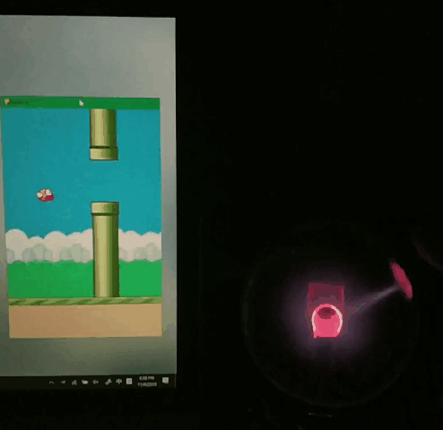
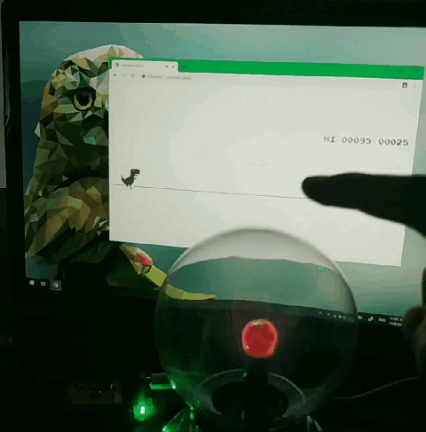

Plasma Ball Touch Sensor
========================

 Plasma ball invented by Nikola Tesla  was quite popular in the 1980s. It was often a standalone exhibition in a science museum. However, now in 2019, we have a different way to use it. We can use it as a touch sensor to create interactive objects.

[](https://www.youtube.com/watch?v=yRZnoBP5i44)

## How to turn a plasma ball into a touch sensor

When we touch a plasma ball, the plasma filaments will be more brighter and be attracted by your hand. If you use an ammeter to measure the current of the plasma ball, you will find that the current is higher than normal when the plasma ball is touched. So we can measure the current to detect if the plasma ball is being touched or not.




## Build the hardware
To sensing the current, A extension board of [Pitaya Go](https://github.com/makerdiary/pitaya-go) has been built. As the Pitaya Go supports USB, BLE and Wi-Fi, it is very easy to connect the touch sensor with other objects.

![img/hardware.jpg]

In this repo, we are going to use it into a USB or BLE one-key keyboard, so we can easily use it with a computer or a phone.

## Get software work
Pitaya  Go is based on nRF52840. It is well supported by the Zephyr OS. So we are going to use Zephyr OS as the framework here. Go to [Zephyr's Getting Started Guide](https://docs.zephyrproject.org/latest/getting_started/index.html) to setup Zephyr development enviroment, and then:

```
git clone  https://github.com/xiongyihui/plasma_ball_touch_sensor.git
cd plasma_ball_touch_sensor
west build -b nrf52840_pca10056
```

Follow [the Pitaya programming guide](https://wiki.makerdiary.com/pitaya-go/programming/) to download the firmware. When get it done, we will get one key USB Keyboard. When touching the plasma ball, it will send a `space` key.

## Have some fun
We can use it to play floppy bird. It's very challenge!



Floppy Bird:

+ javascript version: https://github.com/nebez/floppybird
+ python version: https://github.com/404-Program-not-found/Flappy-bird

When we are offline, the Chrome dinosaur game is a perfect game to play with the plasma ball! (Instead of turning off the Wi-Fi, we can open [chrome://dino/](chrome://dino/) in chrome to play the game)



## Next?
Maybe connect it to the Internet with Wi-Fi, and play it with IFTTT.
